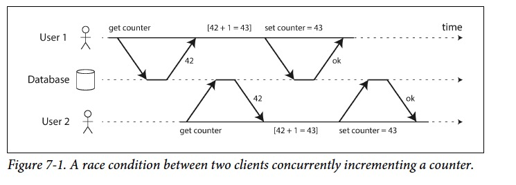
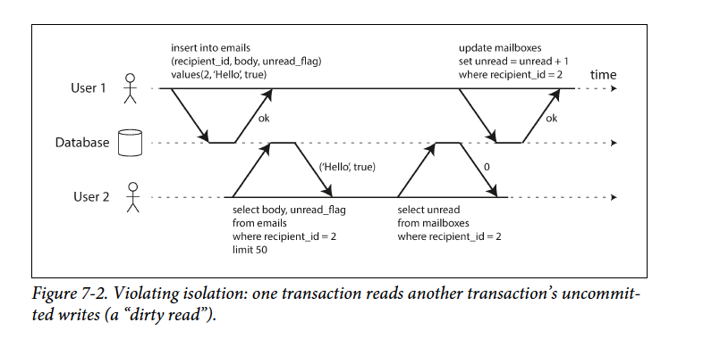
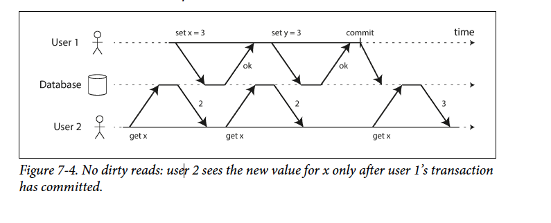
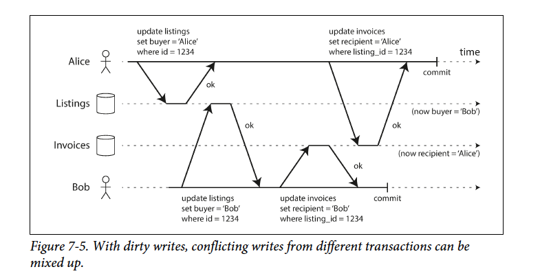
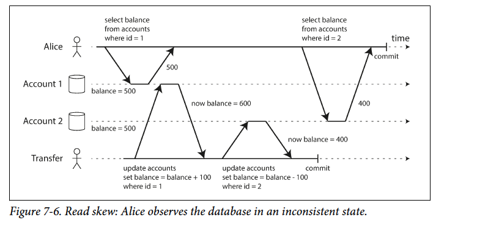
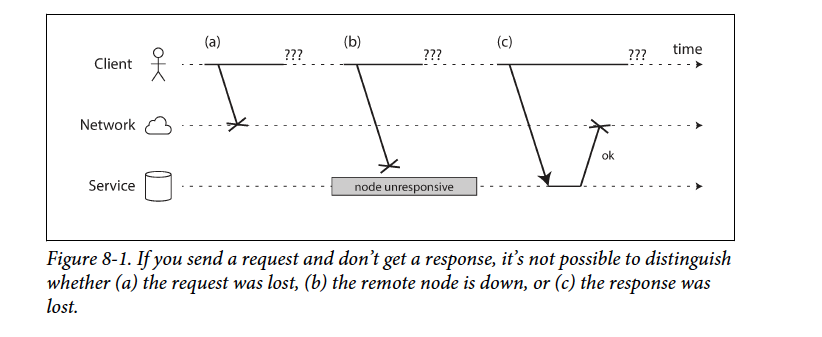
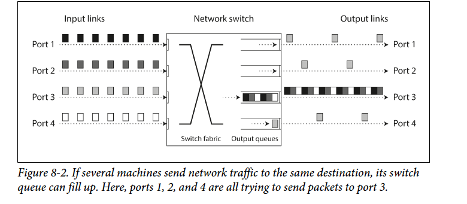
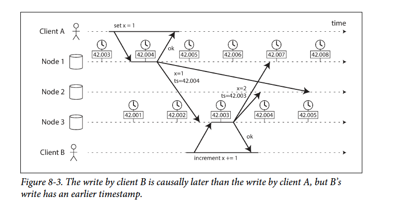
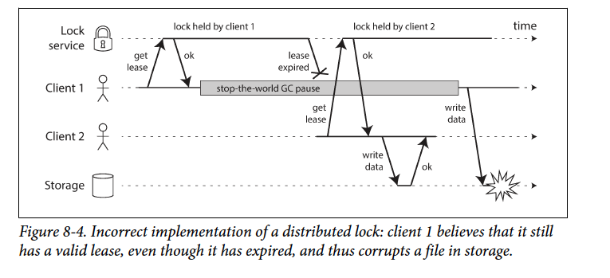
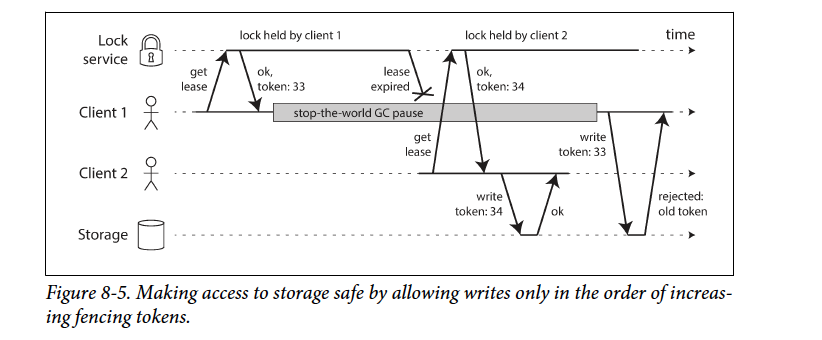

### Partitioning of Key-Value Data

##### Partitioning by Key Range

Disadvantage: the downside of key range partitioning is that certain access patterns can lead to hot spots. If the key is a timestamp, then the partitions correspond to ranges of time—e.g., one partition per day. Unfortunately, because we write data from the sensors to the database as the measurements happen, all the writes end up going to the same partition

Advantage:Within each partition, we can keep keys in sorted order. This has the advantage that range scans are easy, and you can treat the key as a concatenated index in order to fetch several related records in one query.

##### Partitioning by Hash of Key


disadvantage: Unfortunately however, by using the hash of the key for partitioning we lose a nice property of key-range partitioning: the ability to do efficient range queries. Keys that were once adjacent are now scattered across all the partitions, so their sort order is lost.

### Partitioning and Secondary Indexes

##### Partitioning Secondary Indexes by Document


advantage on **write**:each partition maintains its own secondary indexes, covering only the documents in that partition. It doesn’t care what data is stored in other partitions. Whenever you need to write to the database—to add, remove, or update a document—you only need to deal with the partition that contains the document ID that you are writing.

Disadvantage on **read** unless you have done something special with the document IDs, there is no reason why all the cars with a particular color or a particular make would be in the same partition. In Figure 6-4, red cars appear in both partition 0 and partition 1. Thus, if you want to search for red cars, you need to send the query to all partitions, and combine all the results you get back.

##### Partitioning Secondary Indexes by Term


### Rebalancing Partitions

#### Strategies for Rebalancing

##### How not to do it: hash mod N

The problem with the mod N approach is that if the number of nodes N changes, most of the keys will need to be moved from one node to another.

##### Fixed number of partitions


The partition number is fixed, but we can increase the node

##### Dynamic partitioning

When a partition grows to exceed a configured size (on HBase, the default is 10 GB), it is split into two partitions so that approximately half of the data ends up on each side of the split [26]. Conversely, if lots of data is deleted and a partition shrinks below some threshold, it can be merged with an adjacent partition. This process is similar to what happens at the top level of a B-tree

### Operations: Automatic or Manual Rebalancing

#### Request Routing

\1. Allow clients to contact any node (e.g., via a round-robin load balancer). If that node coincidentally owns the partition to which the request applies, it can handle the request directly; otherwise, it forwards the request to the appropriate node, receives the reply, and passes the reply along to the client.

\2. Send all requests from clients to a routing tier first, which determines the node that should handle each request and forwards it accordingly. This routing tier does not itself handle any requests; it only acts as a partition-aware load balancer.

\3. Require that clients be aware of the partitioning and the assignment of partitions to nodes. In this case, a client can connect directly to the appropriate node, without any intermediary.


Many distributed data systems rely on a separate coordination service such as Zoo‐ Keeper to keep track of this cluster metadata, as illustrated in Figure 6-8. Each node registers itself in ZooKeeper, and ZooKeeper maintains the authoritative mapping of partitions to nodes. Other actors, such as the routing tier or the partitioning-aware client, can subscribe to this information in ZooKeeper. Whenever a partition changes ownership, or a node is added or removed, ZooKeeper notifies the routing tier so that it can keep its routing information up to date


#### Parallel Query Execution

### The Slippery Concept of a Transaction

#### The Meaning of ACID

##### Atomicity

ACID atomicity describes what happens if a client wants to make several writes, but a fault occurs after some of the writes have been processed

##### Consistency

The idea of ACID consistency is that you have certain statements about your data (invariants) that must always be true—for example, in an accounting system, credits and debits across all accounts must always be balanced

##### Isolation

That is no problem if they are reading and writing different parts of the database, but if they are accessing the same database records, you can run into concurrency problems (race conditions).

##### Durability

Durability is the promise that once a transaction has committed successfully, any data it has written will not be forgotten, even if there is a hardware fault or the database crashes.

race conidction



#### Single-Object and Multi-Object Operations

Now, whenever a new message comes in, you have to increment the unread counter as well, and whenever a message is marked as read, you also have to decrement the unread counter.



##### Single-object writes

compare-and-set operation 

##### The need for multi-object transactions

There are some use cases in which single-object inserts, updates, and deletes are sufficient. However, in many other cases writes to several different objects need to be coordinated

##### Handling errors and aborts

violating its guarantee of atomicity, isolation, or durability, it would rather abandon the transaction entirely than allow it to remain half-finished. Errors will inevitably happen, but many software developers prefer to think only about the happy path rather than the intricacies of error handling.

**Retry** If the transaction actually succeeded, but the network failed while the server triedto acknowledge the successful commit to the client (so the client thinks it failed), then retrying the transaction causes it to be performed twice

### Weak Isolation Levels

#### Read Committed

Even many popular relational database systems (which are usually considered “ACID”) use weak isolation, so they wouldn’t necessarily have prevented these bugs from occurring.

The most basic level of transaction isolation is read committed.v It makes two guarantees:

1. When reading from the database, you will only see data that has been committed (no dirty reads).

2. When writing to the database, you will only overwrite data that has been committed (no dirty writes)

   **No Dirty Read**



**No Dirty Write**

Read committed prevents such mishaps. However, read committed does not prevent the race condition between two counter increments



**Snapshot Isolation and Repeatable Read**

Say Alice has \$1,000  of savings at a bank, split across two accounts with \$500 each.Now a transaction transfers \$100 from one of her accounts to the other. If she is unlucky enough to look at her list of account balances in the same moment as that transaction is being processed, she may see one account balance at a time before the incoming payment has arrived (with a balance of \$500), and the other account after the outgoing transfer has been made (the new balance being \$400). To Alice it now appears as though she only has a total of $900 in her accounts



Snapshot isolation is the most common solution to this problem. The idea is that each transaction reads from a consistent snapshot of the database—that is, the transaction sees all the data that was committed in the database at the start of the transaction. Even if the data is subsequently changed by another transaction, each transaction sees only the old data from that particular point in time.


## The Trouble with Distributed Systems


### Faults and Partial Failures

if an internal fault occurs, we prefer a computer to crash completely rather than returning a wrong result, because wrong results are difficult and confusing to deal with.

In distributed systems, we are no longer operating in an idealized system model—we have no choice but to confront the messy reality of the physical world.

####  Cloud Computing and Supercomputing

If one node fails, a common solution is to simply stop the entire cluster workload. After the faulty node is repaired, the computation is restarted from the last checkpoint

1 Many internet-related applications are online Making the service unavailable— for example, stopping the cluster for repair—is not acceptable. In contrast, offline (batch) jobs like weather simulations can be stopped and restarted with fairly low impact.

2 Supercomputers are typically built from specialized hardware, where each node is quite reliable. On the other hand, nodes in cloud services are built from commodity machines, which can provide equivalent performance at lower cost due to economies of scale, but also have higher failure rates.

3 Large datacenter networks are often based on IP and Ethernet, arranged in Clos topologies to provide high bisection bandwidth [9]. Supercomputers often use specialized network topologies

4 The bigger a system gets, the more likely it is that one of its components is broken. Over time, broken things get fixed and new things break, but in a system with thousands of nodes, it is reasonable to assume that something is always broken

5 In a geographically distributed deployment (keeping data geographically close to your users to reduce access latency), communication most likely goes over the internet, which is slow and unreliable compared to local networks. Supercomputers generally assume that all of their nodes are close together.

If we want to make distributed systems work, we must accept the possibility of partial failure and build fault-tolerance mechanisms into the software. In other words, we need to build a reliable system from unreliable components.

### Unreliable Networks

The network is the only way those machines can communicate—we assume that each Unreliable Networks machine has its own memory and disk, and one machine cannot access another machine’s memory or disk

In this kind of network, one node can send a message (a packet) to another node, but the network gives no guarantees as to when it will arrive, or whether it will arrive at all.

1 Your request may have been lost

2 Your request may be waiting in a queue and will be delivered later

3 The remote node may have failed

4 The remote node may have temporarily stopped responding

5 The remote node may have processed your request, but the response has been lost on the network

6 The remote node may have processed your request, but the response has been delayed and will be delivered later



The usual way of handling this issue is a timeout: after some time you give up waiting and assume that the response is not going to arrive. However, when a timeout occurs, you still don’t know whether the remote node got your request or not

#### Network Faults in Practice

network problems can be surprisingly common, even in controlled environments like a datacenter operated by one company.

One study in a medium-sized datacenter found about 12 network faults per month, of which half disconnected a single machine, and half disconnected an entire rack

nobody is immune from network problems

**Example 1**a problem during a software upgrade for a switch could trigger a network topology reconfiguration, during which network packets could be delayed for more than a minute

**Example 2** Other surprising faults include a network interface that sometimes drops all inbound packets but sends outbound packets successfully

If the error handling of network faults is not defined and tested, arbitrarily bad things could happen

**Example 1 ** for example, the cluster could become deadlocked and permanently unable to serve requests, even when the network recovers

**Example 2** it could even delete all of your data

Action you may consider to take:

if your network is normally fairly reliable, a valid approach may be to simply show an error message to users while your network is experiencing problems.

deliberately trigger network problems and test the system’s response

#### Detecting Faults

1 A load balancer needs to stop sending requests to a node that is dead

2 In a distributed database with single-leader replication, if the leader fails, one of the followers needs to be promoted to be the new lead

the uncertainty about the network makes it difficult to tell whether a node is working or not. In some specific circumstances you might get some feedback to explicitly tell you that something is not working

1 no process is listening on the destination port (e.g., because the process crashed), the operating system will helpfully close or refuse TCP connections by sending a RST or FIN packet in reply

2 If a node process crashed (or was killed by an administrator) but the node’s operating system is still running, a script can notify other nodes about the crash so that another node can take over quickly without having to wait for a timeout to expire

#### Timeouts and Unbounded Delays

A long timeout means a long wait until a node is declared dead (and during this time, users may have to wait or see error messages)

A short timeout detects faults faster, but carries a higher risk of incorrectly declaring a node dead when in fact it has only suffered a temporary slowdown

1 ：if the node is actually alive and in the middle of performing some action (for example, sending an email), and another node takes over, the action may end up being performed twice

2 : which places additional load on other nodes and the network. If the system is already struggling with high load, declaring nodes dead prematurely can make the problem worse

Maximum package delivered time: d, server process time: r  so 2d+r is the timeout vaule Unfortunately, most systems we work with have neither of those guarantees: asynchronous networks have unbounded delays and most server implementations cannot guarantee that they can handle requests within some maximum time.

##### Network congestion and queueing

1 If several different nodes simultaneously try to send packets to the same destination, the network switch must queue them up and feed them into the destination network link one by one. If there is so much incoming data that the switch queue fills up, the packet is dropped, so it needs to be resend



2 When a packet reaches the destination machine, if all CPU cores are currently busy, the incoming request from the network is queued by the operating system until the application is ready to handle it.

3 In virtualized environments, a running operating system is often paused for tens of milliseconds while another virtual machine uses a CPU core. During this time, the VM cannot consume any data from the network, so the incoming data is queued (buffered) by the virtual machine monitor

4 TCP performs flow control (also known as congestion avoidance or backpressure), in which a node limits its own rate of sending in order to avoid overloading a network link or the receiving node

In public clouds and multi-tenant datacenters, resources are shared among many customers: the network links and switches, and even each machine’s network interface and CPUs (when running on virtual machines), are shared

We can only choose timeouts experimentally, furthermore, rather than using configured constant timeouts, systems can continually measure response times and their variability (jitter), and automatically adjust timeouts according to the observed response time distribution.

#### Synchronous Versus Asynchronous Networks(Hardware level)

When you make a call over the telephone network, it establishes a circuit: a fixed, guaranteed amount of bandwidth is allocated for the call, along the entire route between the two callers. This circuit remains in place until the call ends [32]. For example, an ISDN network runs at a fixed rate of 4,000 frames per second. When a call is established, it is allocated 16 bits of space within each frame (in each direction). Thus, for the duration of the call, each side is guaranteed to be able to send exactly 16 bits of audio data every 250 microseconds This kind of network is **synchronous**

whereas the packets of a TCP connection opportunistically use whatever network bandwidth is available. You can give TCP a variable-sized block of data (e.g., an email or a web page), and it will try to transfer it in the shortest time possible. While a TCP connection is idle, it doesn’t use any bandwidth

Ethernet and IP are packet-switched protocols, which suffer from queueing and thus unbounded delays in the network. These protocols do not have the concept of a circuit. Circuit is good for audio or Video call, but not for requesting a webpage, sending an email or trandering a file. If you wanted to transfer a file over a circuit, you would have to guess a bandwidth allocation. If you guess too low, the transfer is unnecessarily slow, leaving network capacity unused. If you guess too high, the circuit cannot be set up (because the network cannot allow a circuit to be created if its bandwidth allocation cannot be guaranteed).

### Unreliable Clocks

1. Has this request timed out yet?

2. What’s the 99th percentile response time of this service?

3. How many queries per second did this service handle on average in the last five

minutes?

4. How long did the user spend on our site?

5. When was this article published?

6. At what date and time should the reminder email be sent?

7. When does this cache entry expire?

8. What is the timestamp on this error message in the log file?

In a distributed system, time is a tricky business, because communication is not instantaneous: it takes time for a message to travel across the network from one machine to another

Moreover, each machine on the network has its own clock, which is an actual hardware device: usually a quartz crystal oscillator. These devices are not perfectly accurate, so each machine has its own notion of time

#### Monotonic Versus Time-of-Day Clocks

**Time-of-day clocks**

return the number of seconds (or milliseconds) since the epoch: midnight UTC on January 1, 1970, according to the Gregorian calendar, not counting leap seconds. Some systems use other dates as their reference point.

Time-of-day clocks are usually synchronized with NTP, which means that a timestamp from one machine (ideally) means the same as a timestamp on another machine. In particular, if the local clock is too far ahead of the NTP server, it may be forcibly reset and appear to jump back to a previous point in time.

**Monotonic clocks**

for example. The name comes from the fact that they are guaranteed to always move forward. You can check the value of the monotonic clock at one point in time, do something, and then check the clock again at a later time. The difference between the two values tells you how much time elapsed between the two checks. However, the absolute value of the clock is meaningless:

NTP may adjust the frequency at which the monotonic clock moves forward (this is known as slewing the clock) if it detects that the computer’s local quartz is moving faster or slower than the NTP server. By default, NTP allows the clock rate to be speeded up or slowed down by up to 0.05%, but NTP cannot cause the monotonic clock to jump forward or backward.

#### Clock Synchronization and Accuracy

1 Clock drift varies depending on the temperature of the machine. Google assumes a clock drift of 200 ppm (parts per million) for its servers [41], which is equivalent to 6 ms drift for a clock that is resynchronized with a server every 30 seconds, or 17 seconds drift for a clock that is resynchronized once a day.

2 If a computer’s clock differs too much from an NTP server, it may refuse to synchronize, or the local clock will be forcibly reset

3 If a node is accidentally firewalled off from NTP servers, the misconfiguration may go unnoticed for some time.

4 NTP synchronization can only be as good as the network delay, so there is a limit to its accuracy when you’re on a congested network with variable packet delays. One experiment showed that a minimum error of 35 ms is achievable when synchronizing over the internet

5 Some NTP servers are wrong or misconfigured, reporting time that is off by hours [43, 44]. NTP clients are quite robust, because they query several servers and ignore outliers.

6 Leap seconds result in a minute that is 59 seconds or 61 seconds long, which messes up timing assumptions in systems that are not designed with leap seconds in mind [45]. The fact that leap seconds have crashed many large systems [38,46] shows how easy it is for incorrect assumptions about clocks to sneak into a system.

7 In virtual machines, the hardware clock is virtualized, which raises additional challenges for applications that need accurate timekeeping [50]. When a CPU core is shared between virtual machines, each VM is paused for tens of milliseconds while another VM is running.

8 If you run software on devices that you don’t fully control (e.g., mobile or embedded devices), you probably cannot trust the device’s hardware clock at all. Some users deliberately set their hardware clock to an incorrect date and time

Such accuracy can be achieved using GPS receivers, the Precision Time Protocol (PTP) [52], and careful deployment and monitoring. However, it requires significant effort and expertise

#### Relying on Synchronized Clocks

Even though networks are well behaved most of the time, software must be designed on the assumption that the network will occasionally be faulty, and the software must handle such faults gracefully. The same is true with clocks: although they work quite well most of the time, robust software needs to be prepared to deal with incorrect clocks. Any node whose clock drifts too far from the others should be declared dead and removed from the cluster. Such monitoring ensures that you notice the broken clocks before they can cause too much damage.

##### Timestamps for ordering events

if two clients write to a distributed database, who got there first? Which write is the more recent one?

**Example** a dangerous use of time-of-day clocks in a database with multileader replication (the example is similar to Figure 5-9). Client A writes x = 1 on node 1; the write is replicated to node 3; client B increments x on node 3 (we now have x = 2); and finally, both writes are replicated to node 2.



This conflict resolution strategy is called last write wins (LWW), and it is widely used in both multi-leader replication and leaderless databases such as Cassandra [53] and Riak [54] (see “Last write wins (discarding concurrent writes)” on page 186). Some implementations generate timestamps on the client rather than the server

Logical clocks do not measure the time of day or the number of seconds elapsed, only the relative ordering of events (whether one event happened before or after another). In contrast, time-of-day and monotonic clocks, which measure actual elapsed time, are also known as physical clocks.

##### Clock readings have a confidence interval

The uncertainty bound can be calculated based on your time source. If you have a GPS receiver or atomic (caesium) clock directly attached to your computer, the expected error range is reported by the manufacturer. If you’re getting the time from a server, the uncertainty is based on the expected quartz drift since your last sync with the server, plus the NTP server’s uncertainty, plus the network round-trip time to the server.

Google’s TrueTime API in Spanner [41], which explicitly reports the confidence interval on the local clock. When you ask it for the current time, you get back two values: [earliest, latest], which are the earliest possible and the latest possible timestamp

##### Synchronized clocks for global snapshots

The most common implementation of snapshot isolation requires a monotonically increasing transaction ID. If a write happened later than the snapshot (i.e., the write has a greater transaction ID than the snapshot), that write is invisible to the snapshot transaction. With lots of small, rapid transactions, creating transaction IDs in a distributed system becomes an untenable bottleneck

we use the timestamps from synchronized time-of-day clocks as transaction IDs.  Spanner implements snapshot isolation across datacenters in this way [59, 60]. It uses the clock’s confidence interval as reported by the TrueTime API, and is based on the following observation: if you have two confidence intervals, each consisting of an earliest and latest possible timestamp (A = [Aearliest, Alatest] and B = [Bearliest, Blatest]), and those two intervals do not overlap (i.e., Aearliest < Alatest < Bearliest < Blatest), then B definitely happened after A—there can be no doubt.

In order to ensure that transaction timestamps reflect causality, Spanner deliberately waits for the length of the confidence interval before committing a read-write transaction. By doing so, it ensures that any transaction that may read the data is at a sufficiently later time, so their confidence intervals do not overlap. In order to keep the wait time as short as possible, Spanner needs to keep the clock uncertainty as small as possible; for this purpose, Google deploys a GPS receiver or atomic clock in each datacenter, allowing clocks to be synchronized to within about 7 ms

#### Process Pauses

```java
while (true) {
  request = getIncomingRequest();
  // Ensure that the lease always has at least 10 seconds remaining
  if (lease.expiryTimeMillis - System.currentTimeMillis() < 10000) {
  	lease = lease.renew();
  }
  if (lease.isValid()) {
  	process(request);
  }
}
```

imagine the thread stops for 15 seconds around the line lease.isValid() before finally continuing. In that case, it’s likely that the lease will have expired by the time the request is processed, and another node has already taken over as leader.

**The reason why a thread can pause 15 seconds**

1 a garbage collector (GC) that occasionally needs to stop all running threads. These “stop-the-world” GC pauses have sometimes been known to last for several minutes.

2 In virtualized environments, a virtual machine can be suspended (pausing the execution of all processes and saving the contents of memory to disk) and resumed (restoring the contents of memory and continuing execution).

3 On end-user devices such as laptops, execution may also be suspended and resumed arbitrarily

4 When the operating system context-switches to another thread, or when the hypervisor switches to a different virtual machine (when running in a virtual machine), the currently running thread can be paused at any arbitrary point in the code.

5 If the application performs synchronous disk access, a thread may be paused waiting for a slow disk I/O operation to complete

6 If the operating system is configured to allow swapping to disk (paging), a simple memory access may result in a page fault that requires a page from disk to be loaded into memory. The thread is paused while this slow I/O operation takes place. If memory pressure is high, this may in turn require a different page to be swapped out to disk.

##### Response time guarantees

Some software runs in environments where a failure to respond within a specified time can cause serious damage: computers that control aircraft, rockets, robots, cars, and other physical objects must respond quickly and predictably to their sensor inputs

Providing real-time guarantees in a system requires support from all levels of the software stack: a real-time operating system (RTOS) that allows processes to be scheduled with a guaranteed allocation of CPU time in specified intervals is needed; liabrary functions must document their worst-case execution times; dynamic memory allocation may be restricted or disallowed entirely

##### Limiting the impact of garbage collection

1 If the runtime can warn the application that a node soon requires a GC pause, the application can stop sending new requests to that node, wait for it to finish processing outstanding requests, and then perform the GC while no requests are in progress.

2 A variant of this idea is to use the garbage collector only for short-lived objects (which are fast to collect) and to restart processes periodically, before they accumulate enough long-lived objects to require a full GC of long-lived objects

### Knowledge, Truth, and Lies

reliable behavior is achievable, even if the underlying system model provides very few guarantees

#### The Truth Is Defined by the Majority

senario 1 a node can be declared to death when it is semi-disconnected

Senario 2 All of the node’s threads are preempted by the GC and paused for one minute

The moral of these stories is that a node cannot necessarily trust its own judgment of a situation. A distributed system cannot exclusively rely on a single node, because a node may fail at any time, potentially leaving the system stuck and unable to recover. Instead, many distributed algorithms rely on a quorum, that is, voting among the nodes (see “Quorums for reading and writing” on page 179): decisions require some minimum number of votes from several nodes in order to reduce the dependence on any one particular node

##### The leader and the lock

The problem is an example of what we discussed in “Process Pauses” on page 295: if the client holding the lease is paused for too long, its lease expires. Another client can obtain a lease for the same file, and start writing to the file. When the paused client comes back, it believes (incorrectly) that it still has a valid lease and proceeds to also write to the file. As a result, the clients’ writes clash and corrupt the file.



##### Fencing tokens

Let’s assume that every time the lock server grants a lock or lease, it also returns a fencing token, which is a number that increases every time a lock is granted (e.g., incremented by the lock service). We can then require that every time a client sends a write request to the storage service, it must include its current fencing token.



#### Byzantine Faults

Distributed systems problems become much harder if there is a risk that nodes may “lie” (send arbitrary faulty or corrupted responses)—for example, if a node may claim to have received a particular message when in fact it didn’t. Such behavior is known as a Byzantine fault, and the problem of reaching consensus in this untrusting environment is known as the Byzantine Generals Problem

1 In aerospace environments, the data in a computer’s memory or CPU register could become corrupted by radiation

2 In a system with multiple participating organizations, some participants may attempt to cheat or defraud others. In such circumstances, it is not safe for a node to simply trust another node’s messages, since they may be sent with malicious intent. For example, peer-to-peer networks like Bitcoin and other blockchains

However, in the kinds of systems we discuss in this book, we can usually safely assume that there are no Byzantine faults. In your datacenter, all the nodes are controlled by your organization

Simple action

1 Simple measures are usually sufficient protection against such corruption, such as checksums in the application-level protocol.

2 A publicly accessible application must carefully sanitize any inputs from users, for example checking that a value is within a reasonable range and limiting the size of strings to prevent denial of service through large memory allocations

3 NTP clients can be configured with multiple server addresses. When synchronizing, the client contacts all of them, estimates their errors, and checks that a majority of servers agree on some time range.

#### System Model and Reality

With regard to timing assumptions, three system models are in common use:

Synchronous model:  This does not imply exactly synchronized clocks or zero network delay; it just means you know that network delay, pauses, and clock drift will never exceed some fixed upper bound

Partially synchronous model:   Partial synchrony means that a system behaves like a synchronous system most of the time, but it sometimes exceeds the bounds for network delay, process pauses, and clock drift.

Asynchronous model: In this model, an algorithm is not allowed to make any timing assumptions

besides timing issues, we have to consider node failures

Crash-stop faults:  In the crash-stop model, an algorithm may assume that a node can fail in only one way, namely by crashing. This means that the node may suddenly stop responding at any moment, and thereafter that node is gone forever—it never comes back.

Crash-recovery faults: We assume that nodes may crash at any moment, and perhaps start responding

again after some unknown time.

Byzantine (arbitrary) faults:  Nodes may do absolutely anything, including trying to trick and deceive other

nodes, as described in the last section.

##### Correctness of an algorithm

Uniqueness

No two requests for a fencing token return the same value.

Monotonic sequence

If request x returned token tx, and request y returned token ty, and x completed before y began, then tx < ty.

Availability

A node that requests a fencing token and does not crash eventually receives a response.

##### Safety and liveness

safety and liveness properties. In the example just given, uniqueness and monotonic sequence are safety properties, but availability is a liveness property. Safety is often informally defined as nothing bad happens, and liveness as something good eventually happens. However, it’s best to not read too much into those informal definitions, because the meaning of good and bad is subjective.

safety: If a safety property is violated, we can point at a particular point in time at which it was broken. After a safety property has been violated, the violation cannot be undone—the damage is already done

Liveness: A liveness property works the other way round: it may not hold at some point in time but there is always hope that it may be satisfied in the future.

For distributed algorithms, it is common to require that **safety properties always hold, in all possible situations of a system model** [88]. That is, even if all nodes crash, or the entire network fails, the algorithm must nevertheless ensure that it does not return a wrong result

with liveness properties we are allowed to make caveats: for example, we could say that a request needs to receive a response only if a majority of nodes have not crashed, and only if the network eventually recovers from an outage.

##### Mapping system models to the real world

For example, algorithms in the crash-recovery model generally assume that data in stable storage survives crashes. However, what happens if the data on disk is corrupted, or the data is wiped out due to hardware error or misconfiguration

The theoretical description of an algorithm can declare that certain things are simply assumed not to happen—and in non-Byzantine systems, we do have to make some assumptions about faults that can and cannot happen. However, a real implementation may still have to include code to handle the case where something happens that was assumed to be impossible, even if that handling boils down to printf("Sucks to be you") and exit(666)

That is not to say that theoretical, abstract system models are worthless—quite the opposite. They are incredibly helpful for distilling down the complexity of real systems to a manageable set of faults that we can reason about, so that we can understand the problem and try to solve it systematically. We can prove algorithms correct by showing that their properties always hold in some system model.