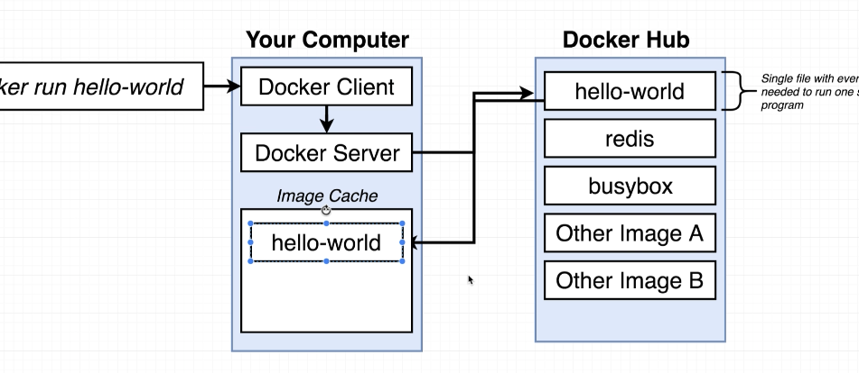
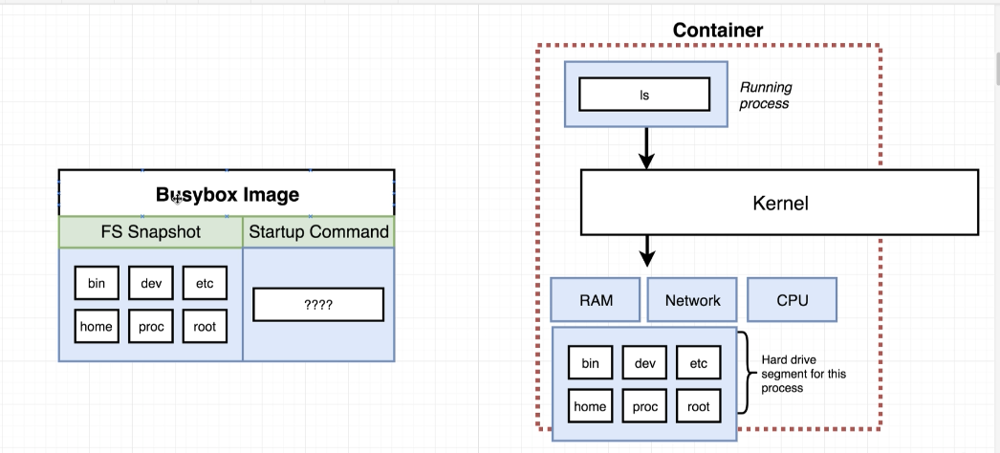
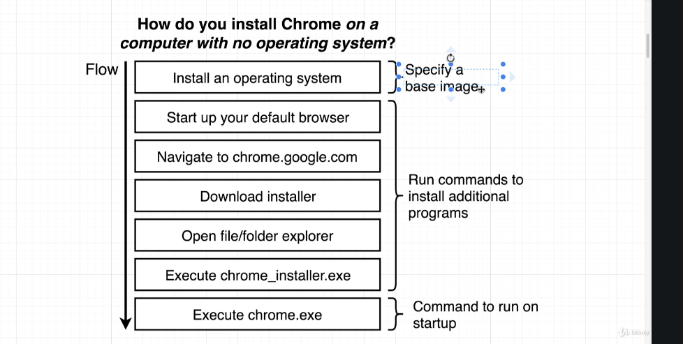

#### Docker: how to run the Hello-World






#### Docker Client(Docker CLI)

command:

1. run the docker image, create a container

   create container + start container

```dockerfile
docker run <image name> //docker create + docker start
```

2.  List all the running container

```dockerfile
docker ps
docker ps -- all  // list all the container run in history
```

3. create a container, return the container ID

```dockerfile
docker create <image name>
```

4. delet all the container

```dockerfile
docker system prune
```

5. ouput the logs

```dockerfile
docker start <container ID>  // will not emit the log
docker logs <container ID> // will emit the log
```

6. Docker stop/kill

```dockerfile
docker stop / kill <container ID>
```

7. execute a command in a running container

```dockerfile
docker exec -it <container ID> <command>
```

#### Build customer image through docker server



```dockerfile
docker build .
docker build -t <dockerID/project name:verion
```

#### Simple Node app running on Docker

Copy the local file to the image file system

```dockerfile
COPY ./ ./
```

Port mapping

```dockerfile
docker run -p <localport> : <docke port> <image id>
```

#### Mutiple containers with Docker Compose

```dockerfile
docker compose up -d (-d make it run background)
docker compose down
```

